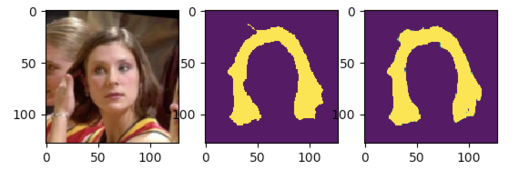

# Real-Time Semantic Segmentation in Mobile device

This project is an example project of semantic segmentation for mobile real-time app.

The architecture is inspired by [MobileNetV2](https://arxiv.org/abs/1801.04381) and [U-Net](https://arxiv.org/abs/1505.04597).

[LFW, Labeled Faces in the Wild](http://vis-www.cs.umass.edu/lfw/part_labels/), is used as a Dataset.

The goal of this project is to detect hair segments with reasonable **accuracy and speed in mobile device**. Currently, it achieves 0.89 IoU.

About speed vs accuracy, more details are available at [my post](https://medium.com/vitalify-asia/real-time-deep-learning-in-mobile-application-25cf601a8976).



## Example application

* [iOS](https://github.com/vfa-tranhv/MobileAILab-HairColor-iOS)
* Android (TODO)

## Requirements

* Python 3.8
* ```pip install -r requirements.txt -f https://download.pytorch.org/whl/torch_stable.html```
* CoreML for iOS app.

## About Model

At this time, there is only one model in this repository, [MobileNetV2_unet](./src/mobile_seg/modules/net.py). As a typical U-Net architecture, it has encoder and decoder parts, which consist of depthwise conv blocks proposed by MobileNets.

Input image is encoded to 1/32 size, and then decoded to 1/2. Finally, it scores the results and make it to original size.

## Steps to training

### Data Preparation

Data is available at LFW. To get mask images, refer [issue #11](../../issues/11) for more. After you got images and masks, put the images of faces and masks as shown below.
```
data/
  lfw/
    raw/
      images/
        0001.jpg
        0002.jpg
      masks/
        0001.ppm
        0002.ppm
```

### Training

If you use 224 x 224 as input size, pre-trained weight of MobileNetV2 is available. It will be automatically downloaded when you train model with the following command.

```
cd src
python run_train.py params/001.yaml
```

Dice coefficient is used as a loss function.

## Pretrained model

|Input size|IoU|Download|
|----|----|---|
|224|0.89|[Google Drive](https://drive.google.com/file/d/11qBqH79RqCaibuACzZD_b9yIY9fwJinJ/view?usp=sharing)|

## Converting

As the purpose of this project is to make model run in mobile device, this repository contains some scripts to convert models for iOS and Android.

* [run_convert_coreml.py](src/run_convert_coreml.py)
  * It converts trained PyTorch model into CoreML model for iOS app.

## TBD

- [x] Report speed vs accuracy in mobile device.
- [ ] Convert pytorch to Android using TesorFlow Light


